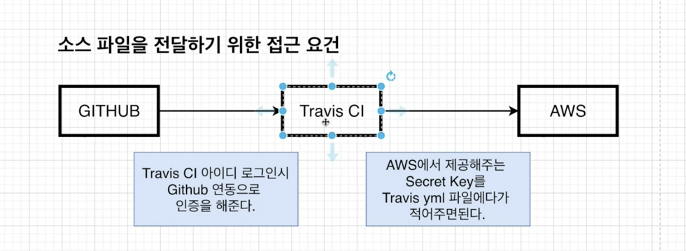

# Travis CI

## Flow

1. `깃헙 master에 푸쉬`
2. `Travis`가 master 코드를 가져와서 아래처럼 행동함
   1. docker-compose.yml에 있는 Dockerfile을 읽어서 `Image를 빌드`
   2. 이미지 생성 후 `Docker Hub`로 전달
3. Docker Hub
   1. Travis CI에서 빌드된 Image를 보관
   2. AWS EBS으로 전달
4. AWS EBS(Elastic Bean Stalk)
   1. EBS를 통해서 배포

## Nodejs 기반의 backend 어플리케이션을 docker와 travisCI를 통해서 CI/CD 해보자

### 먼저, 간단한 backend/index.ts 파일을 보자.

```typescript
import express from "express";
import redis from "redis";
import { pool } from "./db";

// Create Redis client
// const redisClient = redis.createClient({
//   host: "redis-server", // docker-compose.yml에 명시한 컨 테이너 이름으로 준다.
//   port: 6379,
// });
const app = express();

app.get("/", (req, res) => {
  res.send("hello world!");
});
app.get("/api/values", (req, res) => {
  pool.query("SELECT * FROM lists;", (err, result, fields) => {
    if (err) return res.status(500).send(err);
    return res.json(result);
  });
});

app.post("/api/value", (req, res, next) => {
  res.json("hello world");
});

// redisClient.set("number", 0);

// app.get("/", (req, res) => {
//   redisClient.get("number", (err, number) => {
//     redisClient.set("number", +number + 1);
//     res.send(`current count : ${number}`);
//   });
// });

app.listen(8080, () => {
  console.log("✅ Server is running on port 8080");
});
```

<br />

### 다음은 node:alpine 베이스 이미지 위에다가 우리 backend/index.ts 코드를 copy하는 Dockerfile이다.

Dockerfile

```Dockerfile
FROM node:alpine

# Create app directory in case of unexpected overwriting
WORKDIR /app

# For cached node_modules
COPY package*.json ./

RUN npm install

COPY ./ ./

CMD ["npm", "run", "start"]
```

### 마지막으로 깃허브 master 브랜치에 push할 때 Travis가 이를 포착해서 Docker Image를 build하고 빌드된 이미지를 Docker hub로 push하는 yml 파일을 작성한다.

.travis.yml

```yml
language: generic

sudo: required

services:
  - docker

# image build
script:
  - docker build -t 2donny/docker-backend ./backend

# Login docker hub
after_script:
  - echo "$DOCKER_HUB_PASSWORD" | docker login -u "$DOCKER_HUB_ID" --password-stdin

  - docker push 2donny/docker-backend
```

위에서 작성한 .yml에서 이미지를 빌드할 때 `docker build -t 2donny/docker-backend ./backend`에서 entry point를 마지막 인자로 준다. 그 때 backend 폴더의 어떤 Dockerfile을 읽을 지 정의를 해줘하는데 그것을 docker-compose.yml로 해준다

docker-compose.yml

```dockerfile
version: "3"

services:
  backend:
    build:
      dockerfile: Dockerfile
      context: ./backend
    container_name: "app_backend"
    volumes:
      - /app/node_modules
      - ./backend:/app
  # frontend:
  #   build:
  #     dockerfile: Dockerfile.dev
  #     context: ./frontend
  #   container_name: "app_frontend"
  #   volumes:
  #     - /app/node_modules
  #     - ./frontend:/app
  #   stdin_open: true

  # nginx:
  #   restart: "always"
  #   container_name: "app_nginx"
  #   build:
  #     dockerfile: Dockerfile
  #     context: ./nginx
  #   ports:
  #     - "3000:80"

```

위 파일의 하는 역할을 다음과 같다

- backend 폴더의 entry point를 알려줌(build -> context)
- docker file 경로를 알려줌(build -> dockerfile)
- volumes를 통해 docker container 파일 시스템을 local 파일 시스템으로 mapping해줌 (코드 수정시 매번 이미지를 빌드할 필요가 없어짐)

이제 `master 브랜치에 push`하면 `Travis`가 image를 build하고 `Docker Hub`에 전달해준다. 그럼 이제 `AWS Elastic bean stalk`에게 Docker Hub 에있는 이미지로 `EC2 인스턴스`위에서 컨테이너가 실행되게끔 해야한다.

Dockerrun.aws.json 파일에서 Task/Container Definition를 명시하는데. 이 Definition이 Docker Daemon에게 실행을 trigger한다.

Dockerrun.aws.json

```json
{
  "AWSEBDockerrunVersion": 2,
  "containerDefinitions": [
    {
      "name": "backend",
      "image": "2donny/docker-backend",
      "essential": false,
      "memory": 128
    },
    {
      "name": "postgres",
      "image": "2donny/docker-postgres",
      "essential": false,
      "memory": 128
    }
  ]
}
```

- name : 컨테이너 이름
- image : docker hub에 있는 빌드된 이미지 이름
- hostname: 호스트 이름. 이 이름을 통해 docker-compose에서 명시한 다양한 컨테이너에 접근이 가능.
- essential : 컨테이너 실행이 실패할 경우 작업을 중지할지 말지를 명시 (리버스 프록싱을 하는 nginx 같이 stop되면 치명적인 컨테이너는 true로 해준다)
- memory : 컨테이너 인스턴스에 있는 메모리 양
- portMappings : 컨테이너에 있는 네트워크 지점에 매핑한다
- links : 연결한 컨테이너의 목록. 연결된 컨테이너끼리는 통신이 가능
  - ex) links: ['frontend', 'backend']

## EBS, RDS 생성 및 VPC 내에서의 연결

이제는 EBS 환경을 생성해줘야하는데 [AWS EB, RDS 인스턴스 생성 및 연결하기](../aws/EBS/READEME.md) 절차를 모두 따른 후에 다시 와보자.

## Travis CI에서 Deploy

현재까지 한 것은 각각의 이미지들을 빌드한 후 도커허브에 넣어주었습니다.
이제 해야할 일은 AWS으로의 배포를 위해 travis.yml에서 배포관련 설정을 해주어야합니다.

Travis.yml에서 deploy 설정을 해줌으로써 허브로 푸쉬한 이미지를 AWS bean stalk으로 배포할 수 있도록 한다.

```yml
   ...

   deploy:
        provider: elasticbeanstalk
        region: 'ap-northeast-2'
        app: "docker-backend-app"
        env: "Dockerbackendapp-env"
        bucket_name: elasticbeanstalk-ap-northeast-2-471011865482
        bucket_path: "docker-backend-app"
        on:
          branch: master
```

- provider는 배포할 외부 리소스이다. travis 입장에서는 aws가 외부 리소스다
- region은 한국
- app은 EBS의 app 어플리케이션 이름이다
- env는 EBS의 환경이다
- bucket_name은 s3내에 있는 EBS 버킷이다.
  - travis를 통해 배포된 스크립트는 기본적으로 ElasticBeanstalk S3에 먼저 저장되고 실행된다.
- bucket_path는 app과 동일하다
- on은 어떤 브랜치가 push될 때 deploy할 것인가를 결정한다.

## Travis CI에서 Deploy API KEY



> 현재까지는 Travis CI에서 AWS에 어떤 파일(도커 이미지)을 전해줄것이며, AWS에서 어떤 서비스(EBS)를 이용할 것인지와 같은 설정만 정의했다. 하지만 Travis CI가 AWS와 실직적으로 소통을 할 수 있도록 인증하는 부분을 설정하지는 않았다.

그러므로 Travis가 AWS에 접근할 수 있도록 인증을 해야하는데, AWS에서 제공하는 API Key를 Travis.yml에 넣어줌으로써 인증이 가능하다.

### 그럼 어떻게 Secret, Access API Key를 받을까?

> IAM User를 생성해야한다.

1. Iam 콘솔에서 사용자를 생성한다.
   1. 프로그래밍 방식 엑세스
   2. 기존 정책에 연결 선택
   3. 정책 -> AdministratorAccess-AWSElasticBeanstalk 선택
   4. access_key, secret_access_key를 저장한다.
2. Travis CI에 settings에 가서 Environment Variables에 `AWS_ACCES_KEY`, `AWS_SECRET_ACCESS_KEY로` 추가한다.
3. 아래와 같이 travis.yml에 추가해주면 끝난다.

```yml
    ...
    deploy:
        ...
        access_key_id: $AWS_ACCESS_KEY
        secret_access_key: $AWS_SECRET_ACCESS_KEY
```

이제 master에 푸쉬해보자
