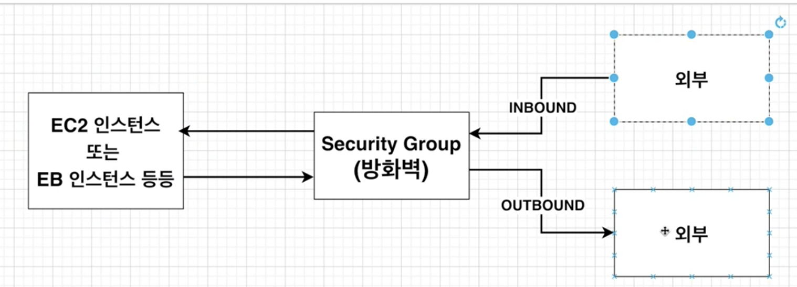

# AWS EBS

## What is EBS

Elastic bean stalk은 여러가지 서비스를 해주는 환경이라고 생각할 수 있다.

EC2, RDS 같은 인스턴스를 관리하고 그들에게 트래픽을 보낼때 Auto Load balancing도 해준다.
또한 Security group 설정이나, VPC 설정도 Bean stalk에서 할 수 있다.


<br />

## Security group and VPC in EB


EBS에서 Security 그룹이나, VPC 설정도 해줘야하는데 그 이유는 EB 인스턴스와(EC2), RDS(PostgreSQL)는 기본적으로 연결이 되어있지 않아서 서로 통신할 수 있게 해야하기 때문이다.

> VPC를 간단하게 이해하자면 AWS에서 만든 EB 인스턴스, RDS 인스턴스를 나의 Id에서만 접근 가능하도록 논리적으로 격리된 Network에서 생성되게끔 해준다. 그러므로 다른 아이디로는 인스턴스가 있는 네트워크에 접근할 수 없다.

EBS를 생성하면 자동으로 EC2 인스턴스, RDS가 생성되고 이 둘은 default VPC가 할당이 된다.

그래서 이 두 인스턴스끼리 통신할 수 있도록 VPC 내에서 연결해야한다.

## 방화벽을 위한 Security Group 설정



VPC 설정하기 전에 Security group 설정을 통해 inbound, outbound 규칙을 설정한다.

- inbound
  - 외부에서 EC2, EB 인스턴스로 요청을 보내는 트래픽
  - HTTP, HTTPS, SSH가 있다.
- outbound
  - inbound로 오는 요청을 외부로 내보내는 트래픽이다.

그럼 어떻게 해서 VPC와 Security Group으로 EB, RDS끼리 통신할 수 있게 만들까?

답은 VPC 안에 있는 AWS 서비스 간에는 트래픽을 모두 허용해주도록 Security 그룹을 허용한다.
이렇게 해줌으로써 VPC 안에있는 서비스끼리의 통신을 가능하게 한다.


## EB, RDS 인스턴스 연결을 위한 Flow

0. EBS 환경을 생성한다.
1. RDS 인스턴스를 생성한다. (EC2는 EBS 생성시 자동으로 생성된다)
2. 콘솔에서 VPC에 들어간다. EB를 생성할 때 자동으로 생성됐던 default VPC를 클릭한다.
3. 왼쪽 '보안 그룹'에 들어간다. (VPC에 대한 보안그룹 설정을 위해)
4. '보안 그룹 생성'을 누르고 '인바운드 규칙'을 다음과 같이 추가해준다.
   1. DB 타입이 postgres 이므로 default port인 5432로 설정하고 TCP 프로토콜을 선택한다.


5. 콘솔에서 RDS에 들어가서 아까 생성한 RDS 인스턴스의 `편집하기`를 누른다.
6. ```보안 그룹 설정```에서 VPC에서 생성한 4번에서 생성한 보안그룹을 선택한다.
7. 이제 RDS가 끝났으니 EB 인스턴스에 대한 보안그룹 설정을 한다
   1. 콘솔에서 EB에 들어가서 0번에서 생성한 환경에 들어간다 -> 왼쪽 ```구성```을 클릭.
   2. ```인스턴스```에서 ```편집```을 클릭
   3. ```인스턴스 보안 그룹```에서 4번에서 생성한 보안그룹을 선택한다.


이렇게 함으로써 VPC 내에서 EB, RDS 인스턴스가 연결되었다.
근데 아직은 ElasticBeanstalk안에 있는 컨테이너들이 RDS 인스턴스와 연결하기 위한 환경변수를 읽지 못한다. 그래서 AWS ElasticBeanstalk에 환경변수를 해야한다.

1. 콘솔에서 Elastic bean stalk
2. 구성을 클릭
3. 소프트웨어 -> 편집
4. ```환경 속성```에서 RDS의 HOST, USER, PASSWORD, DATABASE_NAME, PORT를 지정한다.


