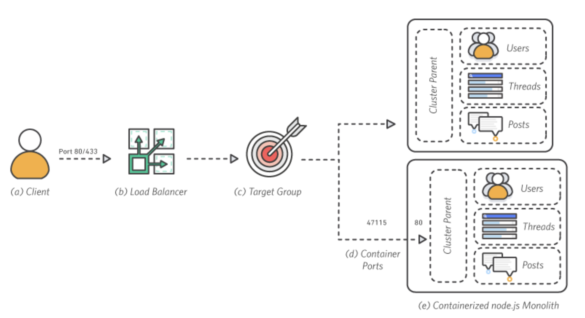
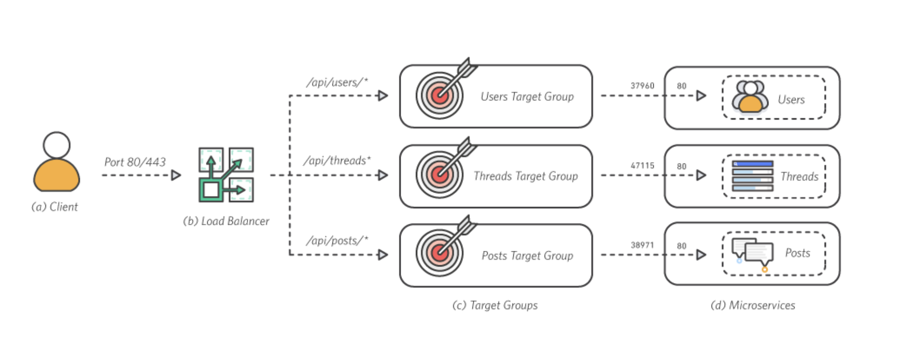

# ECS (Elastic container service)

## [What is Amazon Elastic Container Service](https://docs.aws.amazon.com/AmazonECS/latest/developerguide/Welcome.html)

- ECS is a highly scalable, fast container management service that makes it easy to run, stop, and manage containers on a cluster
- 특정 리전 내 가용 영역에서 컨테이너를 실행하는 과정을 간소화하는 리전 서비스이다.

<br />

## 용어

### Service

- service는 task들을 concurrent하게 실행시키고, 유지보수할 수 있게 해주는 설정이다.
- 지속적으로 실행돼야하는 컨테이너(웹 서버)를 서비스에서 생성한다.

### Task definition

- Task definition은 Task을 실행하거나, 서비스를 만드는데 사용된다.
- `Container`는 service 내에 task definition에서 정의된다.
- 생성만한다고 Cluster 내에 서비스가 실행하지 않는다. Task 실행을 해줘야한다.

<br />

## ECR (Elastic container repository)

- docker image가 저장되는 repository이다.
- docker image는 DockerFile 파일을 통해 build되고, build된 image를 ECR나 Docker hub에 푸쉬한다.
- Task definition을 생성할 때 memory, network, protocol 설정해주고, 앞에서 push한 ECR에서의 image uri를 선택해서 생성한다.
- 그리고 서비스 내에 몇개의 concurrent한 task를 실행할지도 결정한다.

ECS가 각광받는 이유중 Fargate를 들 수 있다. 장점은 다음과 같다.

### Fargate 장점

- AWS Fargate는 컨테이너만 생각
- EC2를 관리할 필요 X, EC2위에 도커를 올릴 필요 X
  - 빠른 개발, 유지보수가 가능해진다.
- 컨테이너에 대한 비용만 지불할 수 있음.
- 배치 작업들을 할 때 유용함.
  - 크롤링과 같은 지속적으로 running할 필요 없고 한번 실행되고 죽어도 되는 작업을 할 때 fargate가 유리하다. 쓸데없이 인스턴스를 올려놓고 대기시키는 과금도 save할 수 있다. [참고링크](https://www.youtube.com/watch?v=bEr_98NRlzc)
  - 또 ECS의 `작업` 탭에서 `예약된 작업`의 `고정된 간격으로 실행` 설정을 통해 분/시간/일 단위로 배치 작업을 예약할 수 있다.
- 이처럼 과금을 크게 줄인다.
  - 기존 서버에서는 EC2가 올라가있기 때문에 EC2에 대한 비용을 지불해야했었다면, Fargate를 통해서 container를 띄우는 비용만 지불하면 된다.

<br />

# Microservice 배포 Flow

> [공식문서](https://aws.amazon.com/ko/getting-started/hands-on/break-monolith-app-microservices-ecs-docker-ec2/)를 참조하였다.

## Monolithic 컨테이너화

1. 가장 먼저 [AWS CLI](https://docs.aws.amazon.com/cli/latest/userguide/install-cliv2-mac.html#cliv2-mac-prereq)를 install하자
   1. 처음 AWS CLI를 인스톨하는 거라면 aws configure도 해야하는데 IAM 사용자를 하나 만들자.
   2. 정책은 다음의 4개를 추가해주자.
      1. AWSCodeDeployRoleForECS
      2. AmazonECS_FullAccess
      3. EC2InstanceProfileForImageBuilderECRContainerBuilds
      4. AWSAppRunnerServicePolicyForECRAccess
   3. 다음 명령어로 AWS ECS에 로그인하자
   ```shell
      aws ecr get-login-password --region ap-northeast-2 | docker login --username AWS --password-stdin <AWS_ACCOUNT_ID>.dkr.ecr.ap-northeast-2.amazonaws.com
   ```
2. 간단한 express 서버 코드를 작성한다.

```javascript
const express = require("express");
const app = express();

app.listen(80, () => {
  console.log("Server is listening on port 80");
});
```

3. 레포지토리 생성
   1. AWS [ECR 콘솔](https://ap-northeast-2.console.aws.amazon.com/ecr/repositories?region=ap-northeast-2)로 가서 레포지토리 생성 클릭
   2. Repository name을 `nestjs-demo`로 생성한다.
4. Docker 이미지 빌드 및 푸쉬
   1. 다시 터미널로 돌아와서 이미지를 빌드한다. `docker build -t nestjs-demo . `
   2. 빌드된 이미지와 ECR 레포지토리를 매핑 `docker tag nestjs-demo:latest 471011865482.dkr.ecr.ap-northeast-2.amazonaws.com/nestjs-demo:latest`
   3. AWS ECR 레포지토리로 푸쉬 `docker push 471011865482.dkr.ecr.ap-northeast-2.amazonaws.com/nestjs-demo:latest`

<br />

## 모놀리스 배포

이 모듈에서는 Amazon Elastic Container Service(Amazon ECS)를 사용하여 EC2 컴퓨팅 인스턴스의 관리형 클러스터를 인스턴스화하고 클러스터에서 실행되는 컨테이너로서 이미지를 배포합니다.

아키텍쳐 구성



### 배포 Flow

우리는 앞에서 ECR repository에 image를 push 해줬다.
이제는 이 image를 ECS 서비스 내에서 배포를 할 차례이다.

1. Cluster를 생성한다. (Fargate 선택)
2. Task definition 생성
   1. `Container 추가` 에서 앞에서 push한 image url을 넣는다.
   2. 웹 서버의 경우 포트 매핑도 해준다.
3. Service를 생성한다.
   1. 시작 유형은 ```fargate```를 선택한다.
   2. `작업 정의`는 위 2번에서 생성한 task definition을 선택한다.
   3. `작업 개수`는 실행될 컨테이너의 수를 의미한다.
   4. ```로드 밸런서```를 선택해야하는데 이 옵션을 사용하려면 미리 생성해야한다. ECS fargate 서비스 생성을 위한 Load balancer, target group 생성은 [이 문서](https://aws.amazon.com/ko/premiumsupport/knowledge-center/create-alb-auto-register/)를 참고해보자
4. 

<br />

## Monolithic을 Microservice 분할

이 단계에서는 NestJS 애플리케이션을 상호 연결된 여러 서비스로 분할하고 각 서비스의 이미지를 Amazon Elastic Container Registry(Amazon ECR) 리포지토리에 푸시합니다

아키텍쳐 구성


- Client

  - 클라이언트가 포트 80을 통해 로드 밸런서로 요청을 보냅니다.

- Load balancer

  - ALB는 외부 트래픽을 해당 서비스로 라우팅합니다. ALB는 클라이언트 요청을 검사하여 라우팅 규칙에 따라 해당 요청을 규칙에 부합하는 인스턴스 및 포트로 경로 설정합니다

- Target group

  - 각 서비스는 해당 서비스에 실행되는 각 컨테이너의 인스턴스 및 포트를 추적할 수 있는 대상 그룹이 있습니다

- Micro service

  - Amazon ECS는 각 서비스를 EC2 클러스터 전체의 컨테이너로 배포합니다. 각 컨테이너는 단일 기능만 처리합니다
