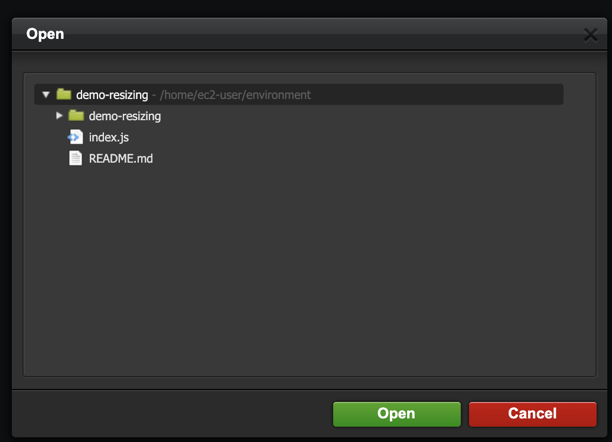

# 01.AWS Lambda로 썸네일 생성

#TIL/aws

# 사용 동기

웹 사이트 속도의 첫 인상을 결정하는 것은 아마도 **첫 이미지 로딩 시간**일 것이다.

**50x50 사이즈**의 이미지를 로딩하는데 **10MB 짜리 400x400 사이즈** 이미지를 로딩하며, 심지어 페이지에 다시 돌아왔을 때 캐싱도 되어있지 않다면 유저는 그 사이트가 느리다고 생각할지도 모른다.

이를 해결하기 위해 `리사이징(Resizing)`기술을 제공하는 `모듈(sharp)`이 나오게 되었고, 이미지 용량을 줄여 로딩 속도를 빠르게하는 ```Best practice```로서 널리 통용되어 사용되고 있다.

이 글에서는 1 편에서 소개했듯이 AWS Lambda 함수로 썸네일을 생성하는 방법을 소개한다.

근데 만약 Lambda를 한번이라도 써본적이 있다면, 여기서 이런 의문점이 생길 수도 있다.

> 굳이 Serverless 서비스인 AWS lambda로 썸네일을 생성할 필요가 있는가? 우리 서버로 "GET /imageUrl?w=300&h=300"와 같은 요청을 보내 처리하면 되지 않는가?

물론 되지만, 위와 같이 한다면 이미지 **용량이 크거나**, **여러 요청이** 들어올 때 서버에 부담이 갈 수 있다는 단점이 있다. 심지어 이미지 서버를 CDN으로 제공하고 있다면 서버로 요청을 보내는 것은 추가적인 **Overhead**일 것이다. 그렇기 때문에 리사이징만을 위하여 서버 자원을 쓰는 것이 좋아보이지는 않는다.

# Lambda@Edge 탄생

그리하여 [AWS Labmda@edge](https://aws.amazon.com/ko/lambda/edge/)라는 서비스가 나오게되었다. 이는 AWS CloudFront의 기능 중 하나인데 독스에도 나와있듯이 CDN에 의해 생성된 이벤트에 대한 응답으로서 Lambda 함수를 실행하는 기술이다.

CDN 도메인으로 ```GET /CDN-IMAGE-URL?w=100&h=100&q=80```와 같이 width, height, quality 쿼리 파라미터가 붙어서 요청이 들어오면 Lambda 함수를 trigger하여 이미지를 리사이징하여 응답하는 것이다.

flow를 보자면 다음과 같다.

1. 클라이언트에서 ```GET /CDN-IMAGE-URL?w=100&h=100&q=80``` 요청을 보냄.
2. CDN에서 w, h, q 쿼리 파라미터가 붙어있으면 ```Lambda 함수를 트리거```
3. 해당 Object(이미지)가 CDN에 캐싱이 되어있으면 해당 Buffer를 사용하고, 없다면 S3 origin에서 가져옴. (만약 없으면 400 error로 응답)
4. ```Sharp``` 모듈을 사용하여 ```w, h, q``` 인자를 통해 이미지 리사이징
5. Base64 형식으로 인코딩하여 클라이언트에게 응답을 리턴
6. 클라이언트는 응답을 읽어 화면에 렌더링.


> Lambda@Edge 서비스의 버즈니아 북부 리전에서만 제공된다. 
> 
> CDN은 이미 적용됐다고 가정하고 진행한다. 아직 안했다면 [1 편을](https://2donny-world.tistory.com/19) 참조하고오자.


# 적용하기

## Lambda 함수 생성

1. Lambda 콘솔로 이동   
2. 함수 생성 클릭
3. 런타임 Node.js 14 버전을 선택
4. 함수 생성

## AWS Cloud9 IDE에서 코드 작성

Lambda 함수 작성을 위한 환경은 Cloud9에서 진행한다.

1. Cloud9 콘솔로 이동
2. 역시 서울리전은 불가하니 버지니아 북부 리전을 선택
3. Create environment 클릭
4. Name 작성하고 Next step 클릭
5. 아래 사진과 같이 default 선택하고, Create environment 클릭

6. 생성한 Cloud9 환경으로 이동


Cloud9의 좋은점은 Lambda에 설정되어 있는 코드를 호출할 수 있다는 점이다. Import와 upload를 마우스 클릭으로 쉽게 할 수 있다. 

7. 왼쪽 탭에 ```AWS 클릭``` -> ```Lambda 클릭``` -> 앞에서 우리가 생성한 Lambda 함수를 클릭


8. 우클릭 후, Download 클릭하면


import가 잘 되었다.


9. index.js가 있는 폴더로 접근한다.

```shell
cd demo-resizing
```

10. Sharp 모듈을 설치한다.

```shell
npm i sharp
``` 

11. index.js 파일 생성한다.


그리고 아래의 코드를 복붙한다.

```javascript
'use strict';

const querystring = require('querystring'); // Don't install.
const AWS = require('aws-sdk'); // Don't install.

// http://sharp.pixelplumbing.com/en/stable/api-resize/
const Sharp = require('sharp');

const S3 = new AWS.S3({
  region: 'ap-northeast-2'  // 버킷을 생성한 리전 입력(여기선 서울)
});

const BUCKET = 'BUCKET_NAME' // Input your bucket

// Image types that can be handled by Sharp
const supportImageTypes = ['jpg', 'jpeg', 'png', 'gif', 'webp', 'svg', 'tiff', 'jfif'];

exports.handler = async(event, context, callback) => {
  const { request, response } = event.Records[0].cf;
  
  console.log("request: ", request)
  console.log("response: ", response)
  
  // Parameters are w, h, f, q and indicate width, height, format and quality.
  const { uri } = request;
  
  const ObjectKey = decodeURIComponent(uri).substring(1);
  const params = querystring.parse(request.querystring);
  const { w, h, q, f } = params
  
  /**
   * ex) https://dilgv5hokpawv.cloudfront.net/dev/thumbnail.png?w=200&h=150&f=webp&q=90
   * - ObjectKey: 'dev/thumbnail.png'
   * - w: '200'
   * - h: '150'
   * - f: 'webp'
   * - q: '90'
   */
  
  // 크기 조절이 없는 경우 원본 반환.
  if (!(w || h)) {
    return callback(null, response);
  }

  
  const extension = uri.match(/\/?(.*)\.(.*)/)[2].toLowerCase();
  console.log('extension : ', extension);
  
  const width = parseInt(w, 10) || null;
  const height = parseInt(h, 10) || null;
  const quality = parseInt(q, 10) || 100; // Sharp는 이미지 포맷에 따라서 품질(quality)의 기본값이 다릅니다.
  let format = (f || extension).toLowerCase();
  let s3Object;
  let resizedImage;

  // 포맷 변환이 없는 GIF 포맷 요청은 원본 반환.
  if (extension === 'gif' && !f) {
    return callback(null, response);
  }

  // Init format.
  format = format === 'jpg' ? 'jpeg' : format;

  if (!supportImageTypes.some(type => type === extension )) {
    responseHandler(
      403,
      'Forbidden',
      'Unsupported image type', [{
        key: 'Content-Type',
        value: 'text/plain'
      }],
    );
    return callback(null, response);
  }


  // Verify For AWS CloudWatch.
  console.log(`parmas: ${JSON.stringify(params)}`); // Cannot convert object to primitive value.\
  console.log('S3 Object key:', ObjectKey)
  console.log('Bucket name : ', BUCKET);
  
  try {
    s3Object = await S3.getObject({
      Bucket: BUCKET,
      Key: ObjectKey
    }).promise();

    console.log('S3 Object:', s3Object);
  }
  catch (error) {
    console.log('S3.getObject error : ', error);
    responseHandler(
      404,
      'Not Found',
      'OMG... The image does not exist.', [{ key: 'Content-Type', value: 'text/plain' }],
    );
    return callback(null, response);
  }

  try {
    resizedImage = await Sharp(s3Object.Body)
      .rotate()
      .resize(width, height)
      .toFormat(format, {
        quality
      })
      .toBuffer();
  }
  catch (error) {
    console.log('Sharp error : ', error);
    responseHandler(
      500,
      'Internal Server Error',
      'Fail to resize image.', [{
        key: 'Content-Type',
        value: 'text/plain'
      }],
    );
    return callback(null, response);
  }
  
  // 응답 이미지 용량이 1MB 이상일 경우 원본 반환.
  if (Buffer.byteLength(resizedImage, 'base64') >= 1048576) {
    return callback(null, response);
  }

  responseHandler(
    200,
    'OK',
    resizedImage.toString('base64'), [{
      key: 'Content-Type',
      value: `image/${format}`
    }],
    'base64'
  );

  /**
   * @summary response 객체 수정을 위한 wrapping 함수
   */
  function responseHandler(status, statusDescription, body, contentHeader, bodyEncoding) {
    response.status = status;
    response.statusDescription = statusDescription;
    response.body = body;
    response.headers['content-type'] = contentHeader;
    if (bodyEncoding) {
      response.bodyEncoding = bodyEncoding;
    }
  }
  
  console.log('Success resizing image');

  return callback(null, response);
};
```

12. 저장 후 다시 우측 창에서 Upload Lambda 클릭 -> Directory 선택


가장 상위 디렉토리 선택 후 Open 클릭



Build 스테이지에서 No 선택 -> Yes 선택.

이렇게 하여 Lambda 함수에 이미지 리사이징 관련 코드를 업로드하였다.
Lambda 콘솔에 가서 코드를 확인하면 바뀐 것을 확인 할 수 있다.
그런데 아직 배포할 수 없다. 그 이유는 Lambda@Edge는 기본적으로 많은 AWS 서비스에 대한 접근을 하게되는데 그렇기에 권한이 필요하다. 

## IAM 권한 설정

Lambda@Edge는 CloudFront로 요청이 들어올 때 Trigger되고, S3 오리진에 
접근하기 때문에 관련 권한을 추가해야한다.

1. IAM 이동 -> 역할 -> 역할 만들기 클릭
2. Lambda 클릭 -> 정책 생성 클릭
3. JSON 탭을 클릭 후 아래 코드를 복붙한다.
```json
{
  "Version": "2012-10-17",
  "Statement": [
      {
          "Sid": "VisualEditor0",
          "Effect": "Allow",
          "Action": [
              "iam:CreateServiceLinkedRole",
              "lambda:GetFunction",
              "lambda:EnableReplication",
              "cloudfront:UpdateDistribution",
              "s3:GetObject",
              "logs:CreateLogGroup",
              "logs:CreateLogStream",
              "logs:PutLogEvents",
              "logs:DescribeLogStreams"
          ],
          "Resource": "*"
        }
    ]
}
```
4. 이름은 ```resizing_policy```로 하고 정책을 생성한다.
5. 이제 다시 돌아와서 이 ```정책```을 사용하는 ```역할```을 만들어야한다. 
6. 방금 생성한 resizing_policy 정책을 선택하여 ```resizing_role``` 이라는 역할을 생성.
7. 생성한 역할 클릭 -> ```신뢰 관계 편집``` 클릭 후 아래 코드 복붙
```json
{
  "Version": "2012-10-17",
  "Statement": [
    {
      "Effect": "Allow",
      "Principal": {
        "Service": [
          "lambda.amazonaws.com",
          "edgelambda.amazonaws.com"
        ]
      },
      "Action": "sts:AssumeRole"
    }
  ]
}
```

## 만든 역할을 Lambda 함수에 주기

1. Lambda 함수로 돌아와서 ```구성``` -> ```권한``` -> ```편집``` 클릭
2. 기존 역할에서 ```resizing_role``` 선택


## Lambda@Edge 배포


작업 -> Lambda@Edge 배포클릭.


여기서는 미리 생성했던 CDN의 ARN을 선택한다.
또한 중요한 점은 CloudFront 이벤트로는 ```오리진 응답```을 선택하자.

그 이유는 최초에 요청 시에 CDN에 Cache miss가 날 것이다. 
그럼 그때는 S3 Origin server로 요청이 가고, 거기서 객체를 CDN으로 캐싱해 놓는다. 그리고 그 때에만 Lambda를 실행하여 이미지를 resizing하고 리사이징 된 이미지 버퍼도 CDN에 캐싱하는 것이다. 그렇기 때문에 Origin response 이벤트 발생 시에만 Lambda를 실행하게 한다.


# 확인 해보자


https://dh2n68u8fomh1.cloudfront.net/uploads/-340b910c-1b94-400f-80ac-14f39d454bc4-1637822827508-Rectangle%202746.jpg?w=112&h=112&q=80

w, h 파라미터에 따라 정상적으로 리사이징이 되었고 위 사진에 경우
500x500 사이즈일 때 **10MB** 짜리 이미지가 50x50 사이즈의 **10KB** 용량으로 줄이는 데 성공했다.


## 정리

글이 좀 길어졌는데 좀 정리를 해보면 다음과 같다.

```CloudFront```가  ```S3로부터 Origin response```를 받을 때 Lambda 함수가 ```Trigger```되어 on-fly 상태에서 Serverless하게 ```sharp 모듈을 통한 Resizing```이 실행된다. 그리고 그 결괏값을 ```CDN에 캐싱```해놓고 추후 요청에서 ```w, h, q``` 파라미터가 같다면 ```Cache hit```을 통하여 클라이언트에게 응답하는 일련의 과정을 마쳤다.

## 성능 평가

부끄럽지만 리사이징 전에 우리 서비스 메인피드의 이미지가 전부 로딩걸리는 데에는 총 10초가 걸렸다. Size를 보면 12MB 짜리 사진도 보인다. 평균적으로 500KB ~ 12MB 정도였다.


그리고 똑같은 사진 대상으로 리사이징 후에 네트워크 탭이다. 

정말 엄청나지 않은가? Size는 평균적으로 200B ~ 12KB로 1000배 이상 용량이 줄었고, Time은 평균적으로 50ms 안으로 로딩이 되었다.

