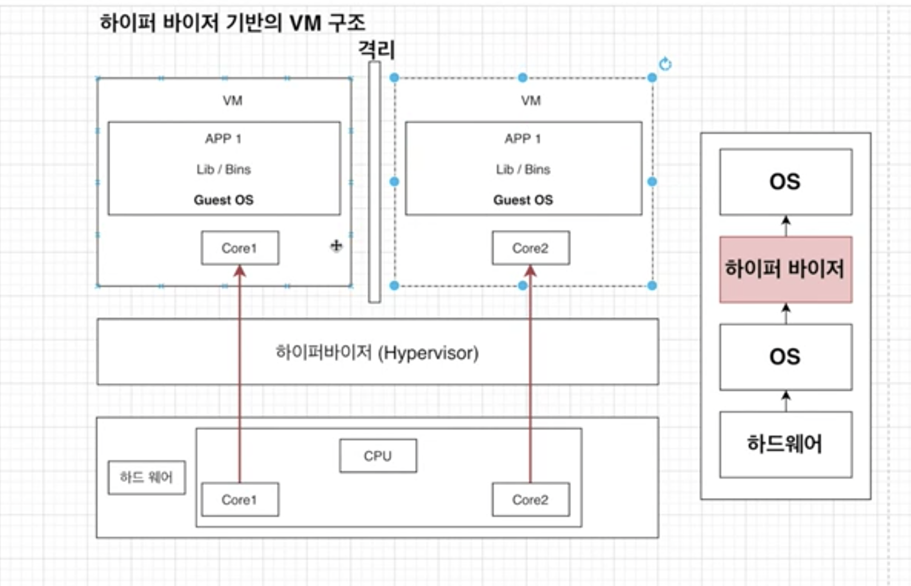
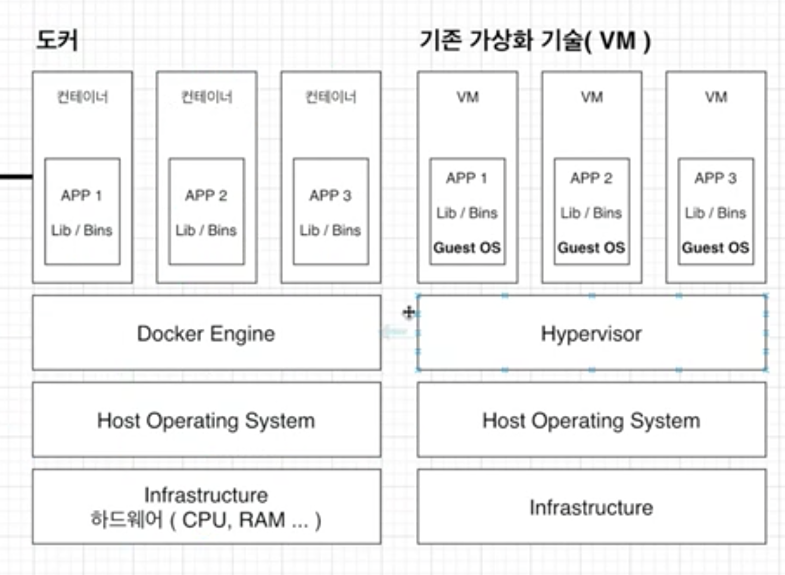

# Docker

> 이 글은 John ahn님의 [도커강의](https://www.inflearn.com/course/%EB%94%B0%EB%9D%BC%ED%95%98%EB%A9%B0-%EB%B0%B0%EC%9A%B0%EB%8A%94-%EB%8F%84%EC%BB%A4-ci/lecture/52271?tab=note&speed=2) 영상을 보고 정리한 글입니다.

## 쓰게된 계기

Xircle 서버를 개발하면서 가상 클라우드 컴퓨터가 필요했다. 그래서 유명한 AWS의 EC2를 사용하여 직접 웹 서버를 구축했었는데 초기 프로그램 세팅이 매우 골치아팠다.

같은 리눅스라도 `Amazon linux`, `ubuntu`가 있고, 그에 따라 `brew install`, `apt-get`, `curl`와 같은 여러가지 패키지 다운로드 툴이 있는데 그러다 보니 다음과 같은 과정을 감수해야한다.

EC2 인스턴스 안에서 client, server 폴더를 만들고 `node`, `npm`, `nest`, 그리고 웹 서버용 `nginx` 다운받고, `nginx.conf` 파일 설정해서 리버스 프록싱하고 `SSL`설정하고
그러다 혹여 `package dependency`에서 conflict 나면 구글링 하면서 resolving 해야하고..

...

사실 비즈니스 로직 만들기도 바쁜데 이런 초기세팅에 많은 시간을 들여야했다.

그러던 도중 docker를 알게되었다.

> docker란 어떤 프로그램을 간단하게 다운로드받기 위해서 사용한다.

기존의 프로그램 실행 순서는 아래와 같이 `curl, get`과 같은 Installer을 먼저 다운받고, 프로그램을 다운받고, 실행하는 순서이다.

1. Intaller 다운로드
2. Installer 실행
3. 프로그램 실행

하지만 도커는 아래 명령어면 설치가 끝난다.

1. docker run -it redis

그리고 오픈 소스이기 때문에 많은 사람들이 dependecy conflict를 고려하여 패키지를 이미지화 시키기 때문에 편리하게 개발을 할 수 있게된다.

 

---

 

# 도커 탄생 배경

## 하이퍼 바이저 기반의 가상화 출현

`하이퍼바이저`는 호스트 시스템에서 다수의 게스트 OS를 구동할 수 있게하는 소프트웨어이다.

논리적으로 공간을 분할하여, VM이라는 독립적인 가상환경의 서버 이용 가능하다.

가령, 하드웨어에 코어가 2개 달린 컴퓨터를 생각해보자. 하이퍼바이저에 의해 구동되는 2개의 VM은 각각 독립된 가상 하드웨어 리소스를 할당받는다.
논리적으로 격리되어있어서 한 VM에 에러가 발생해도 다른 VM에 영향을 주지 않는다.

도커는 이러한 하이퍼바이저 시스템을 토대로 탄생했다.

- VM과 비교햇을 때 컨테이너는 하이퍼바이저와, Guest OS가 필요하지 않으므로 더 가볍다.
- 어플리케이션 실행 관점에서
  - 컨테이너는 호스트 OS 위에 어플리케이션의 실행 패키지인 이미지를 배포하기만 하면 된다.
  - VM은 어플리케이션을 실행하기 위해서, VM을 띄우고 자원을 할당한 다음, 게스트 OS를 부팅하여 어플리케이션을 실행해야하므로 훨씬 무겁고, 복잡하다.