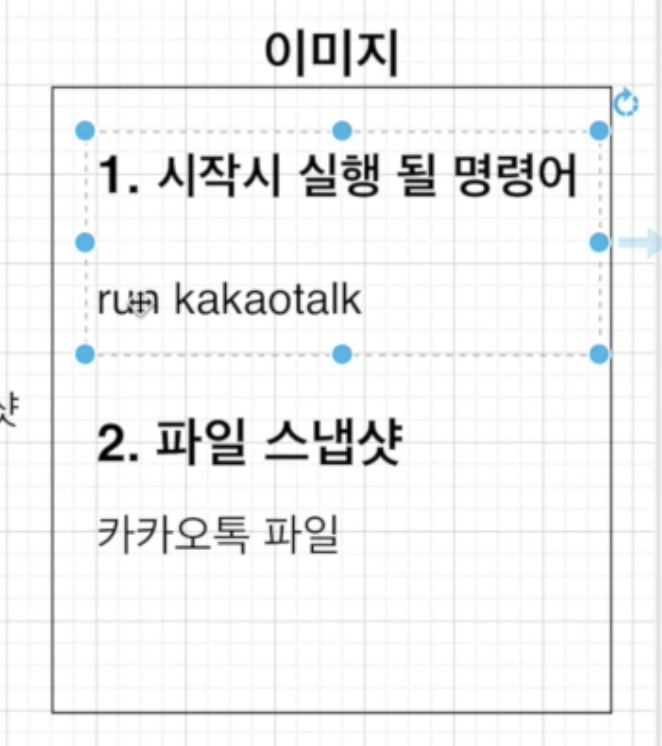

# 용어 정리


## 도커 이미지

- 프로그램을 실행하는 데 필요한 설정이나 종속성들을 갖고있다.
  
## 도커 커네이너
- 이미지의 인스턴스이며, 프로그램을 실행한다.


## Work Flow
- 이미지를 통해 컨테이너를 만들고, 컨테이너 안에서 프로그램이 실행된다.
- 컨테이너가 실행될 때, 같이 실행될 명령어가 필요하다. 이것은 이미지에서 담겨있기에 존재한다.
- 또한, 컨테이너 안에 카카오톡을 실행할 파일(스냅샷)이 필요하다.
  - 즉 컨테이너에는 ```프로그램을 시작할 명령어와```, ```프로그램을 파일 스냅샷```이 존재한다.
- 이미지 안에는 




## Volume
컨테이너에서 실행중인 파일들이 변경될 때의 최적화를 위해 사용한다.
도커 컨테이너가 로컬을 참조(Mapping)해서 빌드, 실행 과정을 줄여준다.