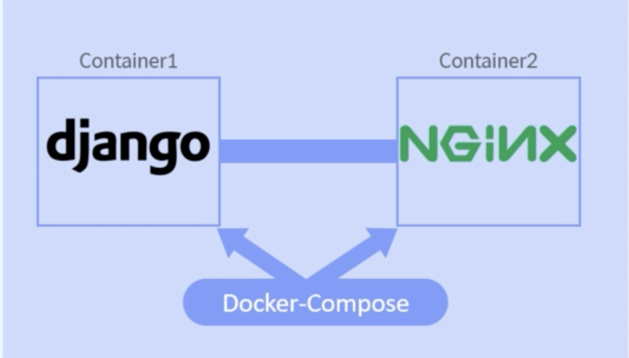

# Docker compose

## 어떤 상황에 쓰는가?

* 컨테이너들은 독립적이지만 마이크로서비스 같은 경우에 서로 유기적으로 연결이 되어야한다 그런 경우에는 이 독립적인 컨테이너들을 연결해야하는데 docker-compose를 통해 가능하다.
* 멀티 컨테이너 환경에서, 컨테이너 사이에 네트워크 통신 시에 쓰인다.
* 컨테이너의 실행 순서를 정의할 떄 쓴다
* 포트 매핑에 쓴다

ex) 위와 같은 경우에는 장고 서버가 먼저 실행된 후에 nginx 컨테이너를 실행해야함.

